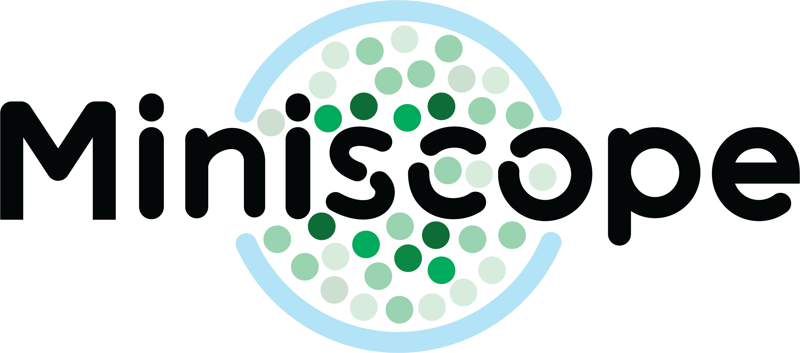

# Miniscope-DAQ-QT-Software (Linux Refactor)

This is a refactor of the original repository to make it work on linux (Tested on Arch Linux with Qt 5.15 + opencv 4.7).
This refactor was mostly just file reorganization. Now, all headers are in the `include` directory, the source files are in `src` and all the `qml` files are in the `resources` directory.
 Other folders were renamed and/or moved, mostly to satify my code organization and naming convention compulsions! 
## How to compile
Following instructions are for compiling from the commandline. I have not tried using `qtcreator`, but it may perhaps be more 'user friendly' to compile using that.
If you have `opencv` or `Qt` installed at a different location please make sure  you fix the `LIB` and `INClUDEPATHS` inside the pro file accordingly before you run these commands.
```
$ mkdir build
$ cd build
$ qmake ../miniscope.pro
```
Make sure that you are running the same `qmake` programme that comes bundled with your Qt installation. Using qmake for different Qt install may lead to errors.
If this steps runs without errors, you should see a Makefile in your build directory. Now, run the `make` tool to build the project

```
$ make -j4
```
 

Readme for the original repository follows.

# Miniscope-DAQ-QT-Software

**[[Miniscope V4 Wiki](https://github.com/Aharoni-Lab/Miniscope-v4/wiki)] [[Miniscope DAQ Software Wiki](https://github.com/Aharoni-Lab/Miniscope-DAQ-QT-Software/wiki)] [[Miniscope DAQ Firmware Wiki](https://github.com/Aharoni-Lab/Miniscope-DAQ-Cypress-firmware/wiki)] [[Miniscope Wire-Free DAQ Wiki](https://github.com/Aharoni-Lab/Miniscope-Wire-Free-DAQ/wiki)] [[Miniscope-LFOV Wiki](https://github.com/Aharoni-Lab/Miniscope-LFOV/wiki)][[2021 Virtual Miniscope Workshop Recording](https://sites.google.com/metacell.us/miniscope-workshop-2021)]**

Neural and behavior control and recording software for the UCLA Miniscope Project

**Make sure to click Watch and Star in the upper right corner of this page to get updates on new features and releases.**

<p align="center">
  
</p>


This backwards compatible Miniscope DAQ software is an upgrade and replacement to our previous DAQ software. It is written completely in QT, using C++ for the backend and QT Quick (QML and Java) for the front end. This software supports all current and previous Miniscopes but requires the most up-to-date version of the [Miniscope DAQ Firmware](https://github.com/Aharoni-Lab/Miniscope-DAQ-Cypress-firmware).

**All information can be found on the [Miniscope DAQ Software Wiki page](https://github.com/Aharoni-Lab/Miniscope-DAQ-QT-Software/wiki).**

Along with this repository holding the software's source code, you can get built release versions of the software on the [Releases Page](https://github.com/Aharoni-Lab/Miniscope-DAQ-QT-Software/releases).
